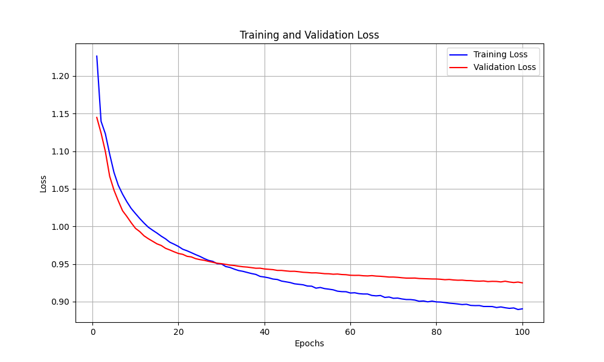
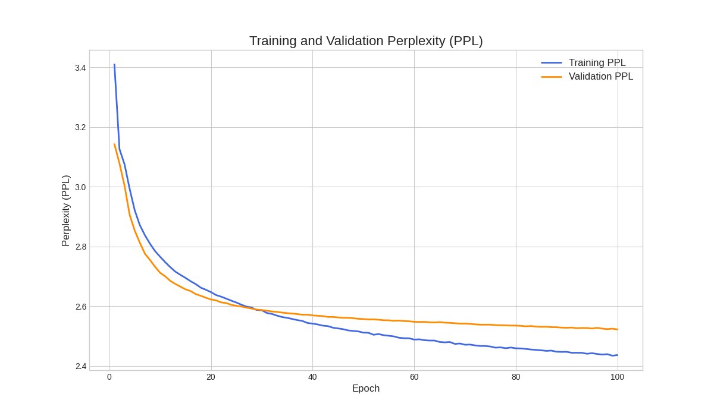
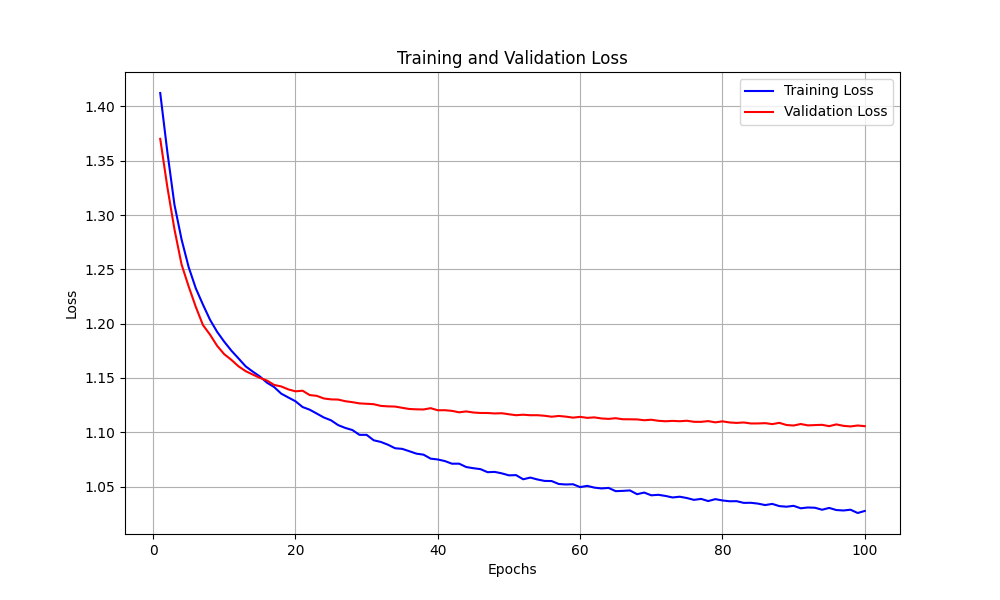
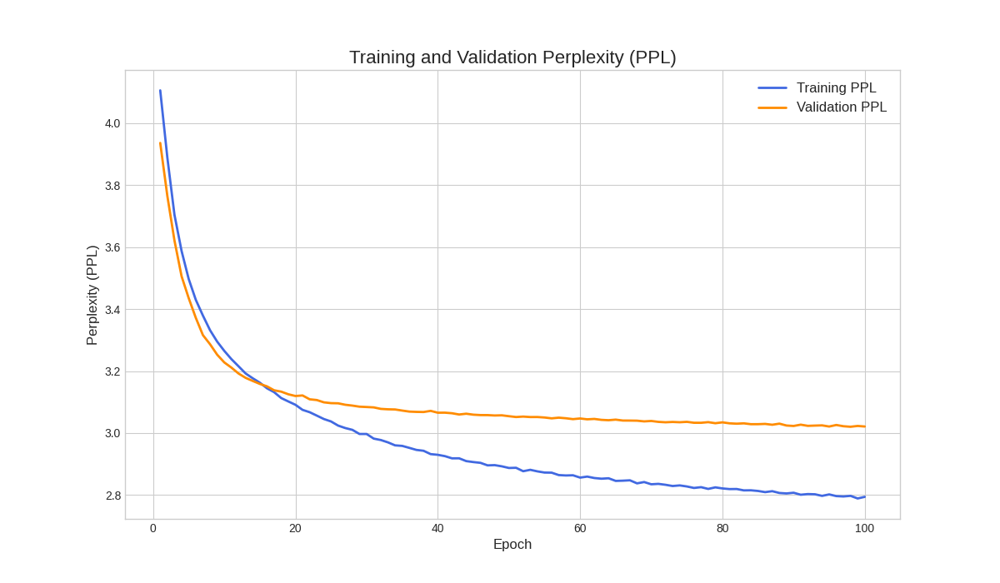

# 从零实现 Transformer (Transformer from Scratch)

[](https://www.python.org/)
[](https://pytorch.org/)

本项目是一个从零开始、不依赖任何高级库（如 `transformers`）的 Transformer 模型实现，专注于自然语言处理中的序列到序列（Seq2Seq）任务。通过该项目，可以深入理解Transformer架构的每一个核心组件。

本项目在经典的**IWSLT 2017 德语-英语**机器翻译任务上对模型进行了完整的训练和评估，并包含了详细的消融实验来验证关键模块的有效性。

---

## ✨ 主要内容

- **模型架构**：
  - [x] 缩放点积注意力 (Scaled Dot-Product Attention)
  - [x] 多头自注意力 (Multi-Head Self-Attention)
  - [x] 位置编码 (Sinusoidal Positional Encoding)
  - [x] 逐位置前馈网络 (Position-wise Feed-Forward Network)
  - [x] 残差连接与层归一化 (Residual Connection & Layer Normalization)
  - [x] 完整的编码器 (Encoder) 和解码器 (Decoder) 结构
  - [x] 掩码机制 (Padding Mask & Look-ahead Mask)

- **训练策略**：
  - [x] 使用 AdamW 优化器
  - [x] 学习率调度 (Cosine Annealing)
  - [x] 标签平滑 (Label Smoothing)
  - [x] 早停机制 (Early Stopping)
  - [x] 支持分布式数据并行训练 (DDP)

- **实验复现**：
  - [x] 提供了完整的训练和评估脚本
  - [x] 包含了详细的超参数配置
  - [x] 提供了训练曲线和消融实验结果

---

## 📂 文件结构

```
Transformer/
├── data/
│   └── de-en/
│       ├── IWSLT17.TED.dev2010.de-en.de.xml
│       └── ... (其他数据集文件)
├── results/
│   ├── training_curves.png
│   ├── test_metrics.json
│   ├── training_validation_ppl_curve.png
│   ├── training_stats.csv
│   └── best_model.pt
├── scripts/
│   └── run.sh
├── src/
│   ├── transformer/
│   │   ├── __init__.py
│   │   ├── attention.py       # 注意力机制实现
│   │   ├── layers.py          # 基础层实现 (FFN, LayerNorm等)
│   │   ├── encoder.py         # 编码器实现
│   │   ├── decoder.py         # 解码器实现
│   │   └── transformer.py     # Transformer模型组装
│   ├── utils/
│   │   ├── __init__.py
│   │   ├── visualization.py   # 可视化脚本
│   │   ├── data_utils.py      # 数据处理工具
│   │   └── train_utils.py     # 训练工具
│   └── train.py               # 训练脚本
├── .gitignore
├── README.md
└── requirements.txt
```

---

## 🚀 快速开始

### 1. 环境准备

- **克隆仓库**:
  ```bash
  git clone https://github.com/zwj2023zwj/Transformer-.git
  cd Transformer-
  ```

- **创建 Conda 环境并安装依赖**: (推荐使用 Python 3.9)
  ```bash
  conda create -n transformer python=3.9
  conda activate transformer
  pip install -r requirements.txt
  ```

### 2. 数据集准备

本项目使用 IWSLT 2017 De-En 数据集。请从 IWSLT 官网下载数据集，解压后将其中的 `*.de.xml` 和 `*.en.xml` 等文件放置于 `data/de-en/` 目录下。

### 3. 开始训练

我们提供了 `run.sh` 脚本来复现实验。该脚本包含了报告中使用的所有超参数。

- **直接运行脚本**:
  ```bash
  bash scripts/run.sh
  ```

- **或者直接执行以下命令**:
  该命令将在两张 GPU 上启动分布式训练，并完整复现报告中的实验。
  ```bash
  torchrun --standalone --nproc_per_node=2 src/train.py \
    --dataset iwslt \
    --data_dir ./data \
    --language_pair de-en \
    --batch_size 256 \
    --epochs 100 \
    --ddp \
    --dist_backend nccl \
    --max_len 100 \
    --d_model 128 \
    --n_layers 3 \
    --n_heads 8 \
    --d_ff 512 \
    --dropout 0.3 \
    --label_smoothing 0.1 \
    --weight_decay 0.02 \
    --patience 5 \
    --save_dir ./results \
    --use_adamw \
    --lr 5e-4 \
    --scheduler cosine \
    --is_pos_encoding True \
    --seed 42
  ```

训练过程中的日志、模型权重和可视化图表将保存在 `results/` 目录下。

---

## 📊 实验结果

### 主要实验

在 IWSLT 2017 De-En 翻译任务上，模型经过约 100 个周期的训练后，在验证集上达到了 **2.5** 左右的困惑度 (Perplexity)，验证了从零实现的 Transformer 模型的有效性。

| 指标 | 训练集 | 验证集 |
| :--- | :---: | :---: |
| 最终损失 (Loss) | 0.90 | 0.925 |
| 最终困惑度 (PPL) | 2.46 | 2.52 |

**训练曲线:**


*图1: 训练和验证损失曲线*


*图2: 训练和验证困惑度曲线*


### 消融实验：移除位置编码

为了验证位置编码 (Positional Encoding) 的关键作用，我们进行了一项消融实验，即在其他所有设置保持不变的情况下，移除位置编码模块。

**训练曲线:**


*图1: 训练和验证损失曲线*


*图2: 训练和验证困惑度曲线*

**结果**:
- 验证集上的困惑度 (PPL) **显著恶化至 3.0 左右**。
- 这有力地证明了位置编码对于 Transformer 捕捉序列顺序信息至关重要。没有它，模型无法区分词序，性能大幅下降。

---

## 🛠️ 硬件与性能

- **硬件环境**: 2 x NVIDIA A40 (48G显存)
- **训练时长**: 约 **4小时10分钟** 完成 100 个周期的训练与验证。